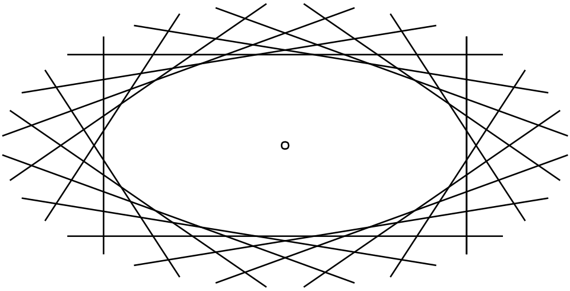

# 二次曲線的對偶結構

對於二次曲線

$$
F(\mathbf{x})=\mathbf{x}^T A\mathbf{x}+\mathbf{b}^T\mathbf{x}+f=0
$$

其中

$$
\mathbf{x}=\begin{bmatrix}x\\y\end{bmatrix}, \quad A=A^T
$$

若取平面上一點 $P(\mathbf{x}_0)$，則透過"換一半"公式(即極線公式)可對應到一直線：

$$
\ell_P : \mathbf{x}_0^T A\mathbf{x}+\mathbf{b}^T\frac{\mathbf{x}+\mathbf{x}_0}{2}+f=0
$$

稱為極點$P$所對應的極線。

 

## 對偶結構

"換一半"公式，建立了極點到極線的對應關係:

$$
\mathbf{x}_0^T A\mathbf{x}+\mathbf{b}^T\frac{\mathbf{x}+\mathbf{x}_0}{2}+f=0
$$

若已知極線 $\mathbf{n}^T \mathbf{x} + k=0$，想反求極點。 先將原式改寫為

$$
\begin{aligned}
(\mathbf{x}_0^T A+ \frac{1}{2} \mathbf{b}^T)\mathbf{x} + \frac{1}{2} \mathbf{b}^T\mathbf{x}_0 +f=0 \\
(A \mathbf{x}_0 + \frac{1}{2} \mathbf{b})^T \mathbf{x} + \frac{1}{2} \mathbf{b}^T\mathbf{x}_0 +f=0
\end{aligned}
$$ 

因此得到關係式:

$$
\begin{aligned}
\mathbf{n} = A \mathbf{x}_0 + \frac{1}{2} \mathbf{b} \\
k = \frac{1}{2} \mathbf{b}^T\mathbf{x}_0 + f
\end{aligned}
$$

若 $A$ 可逆，可解出唯一的極點 $\mathbf{x}_0$。

因此當 $A$ 可逆時，

$$
\boxed{
\text{極點 } P \longleftrightarrow \text{極線 } \ell_P
}
$$

這正是二次曲線中的對偶結構。

 

## La Hire Theorem

設平面上兩點分別為 $P_1(\mathbf{x}_1)$、$P_2(\mathbf{x}_2)$。  
若點 $P_2$ 在點 $P_1$ 的極線上，則將 $\mathbf{x}_2$ 代入 $P_1$ 的極線方程式可得：

$$
\mathbf{x}_1^T A\mathbf{x}_2+\mathbf{b}^T\frac{\mathbf{x}_1+\mathbf{x}_2}{2}+f=0
$$

由於矩陣 $A$ 為對稱矩陣，故有

$$
\mathbf{x}_1^T A\mathbf{x}_2
=
(\mathbf{x}_1^T A\mathbf{x}_2)^T
=
\mathbf{x}_2^T A^T\mathbf{x}_1
=
\mathbf{x}_2^T A\mathbf{x}_1
$$

因此上式等價於

$$
\mathbf{x}_2^T A\mathbf{x}_1+\mathbf{b}^T\frac{\mathbf{x}_2+\mathbf{x}_1}{2}+f=0
$$

這表示點 $P_1$ 也在點 $P_2$ 的極線上。

所以我們得到：

$$
\boxed{
P_2 \text{ 在 } P_1 \text{ 的極線上}
\iff
P_1 \text{ 在 } P_2 \text{ 的極線上}
}
$$

這個性質描述極點與極線的對稱性，也稱為 La Hire Theorem。

 

從 La Hire Theorem，可得到下列對應。

若兩點 $A,B$ 都在某點 $P$ 的極線上，則點 $P$ 也必在 $A,B$ 各自的極線上。  
也就是說，若一個點在另外兩點的極線上，則那兩點的極線交於此點。

換句話說，原本「兩點決定一直線」的結構，經過"換一半"公式對應後，會轉成「兩線交於一點」的結構。

因此，對偶關係如下：

- 點 $\longleftrightarrow$ 線
- 共線 $\longleftrightarrow$ 共點
- 兩點連線 $\longleftrightarrow$ 兩線交點

 

## 射影平面

到目前為止，我們的討論都在仿射平面 $\mathbb{R}^2$ 中進行。  
這樣已足以處理許多問題，但若想把點線對偶寫成沒有例外的理論，仍會遇到一些困難。

### 1. 平行線沒有交點

在對偶的語言裡，「兩線交於一點」與「兩點連成一直線」應當彼此對應。  
但在仿射平面中，平行線沒有交點，因此某些對應會出現缺口。

### 2. 反求極點時可能失敗

由極線方程式可知，若反過來給定一直線，想求其極點 $\mathbf{x}_0$，便需要解反矩陣。  
若 $A$ 不可逆，例如拋物線的情形；以及退化二次曲線中也會出現類似問題，則此反推過程會失效。

 

因此，為了補足這些缺口，並保留點線對偶的完整結構，我們需要引入**齊次座標**，將仿射平面擴充為射影平面。

在射影平面中：

- 平行線交於無窮遠點；
- 點與線的角色更對稱；
- 二次曲線可統一表示為單一的齊次二次型。

 

## 射影二次曲線

在仿射平面中，二次曲線可寫為

$$
F(x,y)=ax^2+bxy+cy^2+dx+ey+f=0
$$

引入齊次座標後，可改寫為

$$
F(x,y,z)=ax^2+bxy+cy^2+dxz+eyz+fz^2=0
$$

其中原仿射平面對應於 $z=1$。

若記

$$
\mathbf{X}=
\begin{bmatrix}
x\\y\\1
\end{bmatrix}
$$

則原式可寫成

$$
\boxed{
\mathbf{X}^TQ\mathbf{X}=0
}
$$

其中

$$
Q=
\begin{bmatrix}
a & \frac{b}{2} & \frac{d}{2} \\
\frac{b}{2} & c & \frac{e}{2} \\
\frac{d}{2} & \frac{e}{2} & f
\end{bmatrix}
=
Q^T
$$

因此，原本仿射形式中的二次項、一次項與常數項，可統一寫成一個齊次二次型。

 

## 射影平面中的極線

在射影平面中，若取一點

$$
\mathbf{X}_0=
\begin{bmatrix}
x_0\\y_0\\1
\end{bmatrix}
$$

則其對應極線為

$$
\boxed{
\mathbf{X}_0^TQ\mathbf{X}=0
}
$$

這正是仿射平面中"換一半"公式在齊次座標下的寫法，並可改寫為

$$
(\mathbf{X}_0Q^T)^T \mathbf{X}=0.
$$

若一直線記為

$$
\mathbf{L}=
\begin{bmatrix}
u\\v\\1
\end{bmatrix}
$$

則其方程式為

$$
u x+v y+z=0
$$

亦即

$$
\mathbf{L}^T\mathbf{X}=0
$$

比較兩式可得

$$
\mathbf{L} = \mathbf{X}_0Q^T = \mathbf{X}_0Q
$$

也就是點 $\mathbf{X}_0$ 的極線表示式:

$$
\boxed{
\mathbf{L}=Q\mathbf{X}_0
}
$$

因此，矩陣 $Q$ 給出一個由點到線的對應。

 

## 對偶二次曲線

以下先考慮 $Q$ 可逆的情形。

若點 $\mathbf{X}$ 在二次曲線上，極線即為該點的切線:

$$
\mathbf{L}=Q\mathbf{X}
$$

而二次曲線滿足

$$
\mathbf{X}^TQ\mathbf{X}=0
$$

由於 $Q$ 可逆，可寫成

$$
\mathbf{X}=Q^{-1}\mathbf{L}
$$

代回原式可得

$$
(Q^{-1}\mathbf{L})^TQ(Q^{-1}\mathbf{L})=0
$$

由於 $Q=Q^T$，故 $Q^{-1}=(Q^{-1})^T$，因此化簡為

$$
\boxed{
\mathbf{L}^TQ^{-1}\mathbf{L}=0
}
$$

此式描述的不是曲線上的點，而是此二次曲線的所有切線。  
因此稱為原二次曲線的**對偶二次曲線**。

 

對於非退化二次曲線，可由兩種方式描述同一個幾何對象。

### 點的觀點

$$
\mathbf{X}^TQ\mathbf{X}=0
$$

描述曲線上的所有點。

### 線的觀點

$$
\mathbf{L}^TQ^{-1}\mathbf{L}=0
$$

描述與曲線相切的所有直線。

因此，二次曲線不僅可以看成點的軌跡，也可以看成切線的包絡。  
這就是射影平面中二次曲線的對偶結構。

 

Img: Dual of Ellipse.