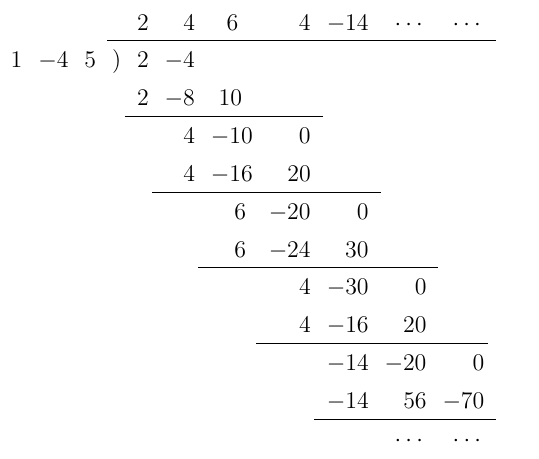

# 任意多項式根的 n 次方和

 

## 公式

根據代數基本定理，任意 $k$ 次多項式都可寫成

$$
f(x)=a(x-\alpha_1)(x-\alpha_2)\cdots(x-\alpha_k).
$$

若定義根的 $n$ 次方和為

$$
S_n=\alpha_1^n+\alpha_2^n+\cdots+\alpha_k^n,
$$

則有展開式

$$
\boxed{
\frac{f'(x)}{f(x)}
=
\frac{S_0}{x}
+
\frac{S_1}{x^2}
+
\frac{S_2}{x^3}
+\cdots
}
$$

其中

$$
S_0=\alpha_1^0+\alpha_2^0+\cdots+\alpha_k^0=k.
$$

 

## 證明

先由
$$
1=(x)'=(e^{\ln x})'=(e^{\ln x})(\ln x)'=x(\ln x)'
$$
得
$$
(\ln x)'=\frac{1}{x}.
$$

接著對

$$
f(x)=a(x-\alpha_1)(x-\alpha_2)\cdots(x-\alpha_k)
$$

取 $\ln$ 並微分：

$$
(\ln f(x))'=(\ln a+\ln(x-\alpha_1)+\ln(x-\alpha_2)+\cdots+\ln(x-\alpha_k))'
$$

等號兩邊可改寫:

$$
\begin{aligned}
\frac{f'(x)}{f(x)}
&=\frac{1}{x-\alpha_1}+\frac{1}{x-\alpha_2}+\cdots+\frac{1}{x-\alpha_k} \\
&=\frac{1}{x}\left(\frac{1}{1-\alpha_1/x}+\frac{1}{1-\alpha_2/x}+\cdots+\frac{1}{1-\alpha_k/x}\right) \\
&=\frac{1}{x}\left(\left(1+\frac{\alpha_1}{x}+\frac{\alpha_1^2}{x^2}+\cdots\right)+\left(1+\frac{\alpha_2}{x}+\frac{\alpha_2^2}{x^2}+\cdots\right)+\cdots\right) \\
&=\frac{S_0}{x}+\frac{S_1}{x^2}+\frac{S_2}{x^3}+\cdots
\end{aligned}
$$

> ※ 此處若從收斂角度看，需有 $|x|>\max\{|\alpha_1|,\dots,|\alpha_k|\}$；但本文只是將其作為 $1/x$ 的展開與係數比較，也就是代數上的改寫，因此收斂與否不影響結論。

## 例子

考慮多項式 $f(x)=x^2-4x+5$，設其二根為 $\alpha,\beta$，要求 $\alpha^4+\beta^4$.

先求導數：

$$
f'(x)=2x-4.
$$

做多項式除法：

所以

$$
\frac{f'(x)}{f(x)}=\frac{2}{x}+\frac{4}{x^2}-\frac{6}{x^3}+\frac{4}{x^4}+\frac{-14}{x^5}+\cdots
$$

由

$$
\frac{f'(x)}{f(x)}=\frac{S_0}{x}+\frac{S_1}{x^2}+\frac{S_2}{x^3}+\frac{S_3}{x^4}+\frac{S_4}{x^5}+\cdots
$$

可得

$$
S_4=-14.
$$