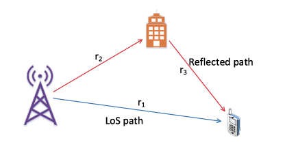
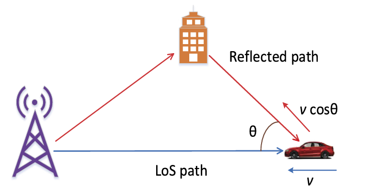

# High Mobility Wireless Channel

## Geometric Model

### 情況1: Paths with different propagation delays.

當傳送訊號 $s(t)$ 在直視路徑(LOS)與反射路徑分別有基頻等效增益 $g_1$ 和 $g_2$ 
baseband equivalent complex gain, attenuation)，
那麼根據波的疊加原理，接收訊號可以表示為:

$$
r(t) = g_1 s(t-\tau_1) + g_2 s(t-\tau_2),
$$

其中 $\tau_1=r_1/c, \tau_2=(r_2+r_3/c)$ 分別是直視路徑與反射路徑的延遲(delay)。

 

### 情況2: Paths with different Doppler shifts.

若 $s(t)$ 的頻寬是 $B$，則都卜勒頻移可表示為

$$
\nu = \frac{v}{c}f \cos \theta,
$$

其中 $f \in \[f_c-\frac{B}{2}, f_c+\frac{B}{2}\]$, $f_c$ 是載波頻率。 
當 $f_c \gg B$ 時， 都卜勒頻移化簡為

$$
\nu = \frac{v}{c}f_c \cos \theta.
$$

根據傅立葉轉換， $S(f-\nu) \leftrightarrow e^{j2\pi \nu t}s(t)$，
所以接收訊號可以表示為:

$$
r(t) = g_1 e^{j2\pi \nu_1 (t-\tau_1)} s(t-\tau_1) + g_2 e^{j2\pi \nu_2 (t-\tau_2)} s(t-\tau_2),
$$

其中 $\nu_1=vf_c/c, \nu_2=vf_c \cos \theta/c$ 分別是直視路徑與反射路徑的都卜勒頻移(Doppler  shift)，

並定義出時變增益 (time-varying attenuation)，

$$
g(\tau_i, t) = g_i e^{j2\pi \nu_i (t-\tau_i)}, \quad i=1,2，
$$

因此，通道的 delay-time impulse response 為

$$
g(\tau, t) = g(\tau_1, t) \delta(\tau - \tau_1) + g(\tau_2, t) \delta(\tau - \tau_2).
$$

 

### 考慮一般化的情況，通道有 $P$ 個路徑

當通道有 $P$ 個路徑時，通道的 delay-time impulse response 為

$$
g(\tau, t)
= \sum_{i=1}^{P} g(\tau_i, t) \delta(\tau - \tau_i)
= \sum_{i=1}^{P} g_i e^{j2\pi \nu_i (t-\tau_i)} \delta(\tau - \tau_i).
$$

所以多徑衰變通道 (multipath fading channel)，可以表示成LTV (linear time varying) 形式:

$$
r(t)
= \sum_{i=1}^{P} g(\tau_i, t) s(\tau - \tau_i)
= \int_{0}^{\infty} g(\tau, t) s(t-\tau) d\tau.
$$

從圖一、圖二可知，延遲變數 $\tau$，是用來描述訊號的，所以對應的傅立葉變數為頻率 $f$。
而時間變數 (絕對時間、觀測時間) $t$，是用來描述環境的，因此對應的傅立葉變數為都普勒 $\nu$。

因此 frequency-time impulse response 為

$$
H(f, t)
= \int_{\tau} g(\tau, t) e^{-j2\pi f \tau} d\tau
= \sum_{i=1}^{P} g_i e^{-j2\pi \nu_i \tau_i} e^{-j2\pi (f\tau_i-\nu_it)}.
$$

其中第一項代表衰減，第二項代表初始相位，第三項則是頻率和時間的波函數。
因為到達的時間差 (delay) ，造成建設性或破壞性干涉，可發現在固定 $t$ 時，無線通道環境對不同頻率會產生濾波效果
 (即 frequency selective channel)。

當通道是靜態的特例時， $\nu_i = 0$，且 $H(f,t)$ 不再是 $t$ 的函數，
因此

$$
H(f) = \sum_{i=1}^{P} g_i e^{-j2\pi f \tau_i}.
$$

---

## Delay-Doppler Representation

